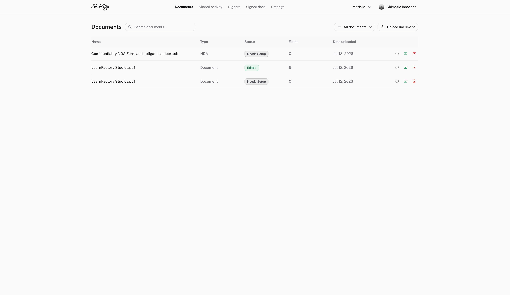
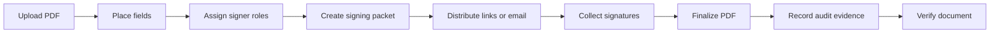
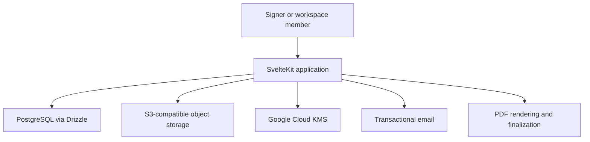

# SleekSign

Self-hosted document signing with reusable workflows, explicit signer roles, audit trails, and verifiable PDFs.

[Live product](https://sign.mezie.dev) · [Document verification design](https://github.com/Vic-Orlands/sleeksign/blob/main/docs/blog/how-we-use-google-cloud-kms-to-verify-sleeksign-documents.md)



## What SleekSign handles

SleekSign turns a PDF into a signing workflow. A workspace can upload a document, place fields, assign each field to a signer role, select how recipients should share or isolate state, distribute signing links, and retain the completed document with its audit history.

- Typed, drawn, and uploaded signatures
- Signature, text, date, and checkbox fields
- Drag, resize, required-state, and role assignment controls
- Reusable signer groups and recipient directories
- Email, link, and CSV-based bulk distribution
- Shared, collaborative, and recipient-isolated signing packets
- Signer timelines and grouped audit events
- Finalized PDF generation and public verification
- Workspace membership, branding, and custom-domain foundations

## Workflow models

| Model | Behaviour | Useful for |
| --- | --- | --- |
| Collaborative | Every signer works on the same live packet and can see shared signatures. | Agreements completed by several participants |
| Individual | Every recipient receives an isolated copy with no cross-recipient visibility. | Acknowledgements and individual forms |
| Shared base | A shared role signs once, then each recipient signs a private copy that includes the shared signature. | Employer, school, or organization-led distribution |

## How a document moves through the system



The workflow model is explicit instead of being inferred from the number of recipients. That keeps shared and private field behaviour predictable throughout signing and finalization.

## Verification model

SleekSign creates a verification record for finalized documents and uses Google Cloud KMS for cryptographic signing operations. The application stores verification metadata separately from the document bytes so a verification page can explain what was signed and whether the evidence still matches.

The design and operational boundaries are documented in:

- [`docs/blog/how-we-use-google-cloud-kms-to-verify-sleeksign-documents.md`](./docs/blog/how-we-use-google-cloud-kms-to-verify-sleeksign-documents.md)
- [`DOCUMENT_VERIFICATION.md`](./DOCUMENT_VERIFICATION.md)

This is application-level verification, not a claim of regulatory certification. Deployers remain responsible for their legal, identity, retention, and compliance requirements.

## Architecture



The application keeps document metadata, roles, packet state, signatures, and audit events in PostgreSQL. Original and finalized files live in object storage. Presigned upload and download operations keep large file transfers away from the application database.

## Stack

- Svelte 5 and SvelteKit
- TypeScript and Tailwind CSS
- PostgreSQL, Neon, and Drizzle ORM
- Better Auth
- S3-compatible object storage and presigned URLs
- Google Cloud KMS
- PDF.js and pdf-lib
- Resend and React Email
- Vitest

## Local development

Requirements: Node.js, pnpm, PostgreSQL, an S3-compatible bucket, and the external services represented in `.env.example`.

```bash
pnpm install
cp .env.example .env.local
pnpm dev
```

Apply the repository’s Drizzle migrations before opening the authenticated workspace.

## Verification

```bash
pnpm check
pnpm lint
pnpm test
pnpm build
```

## Project status

SleekSign is an active, self-hostable product. Before using it for sensitive or regulated agreements, review the identity, retention, delivery, backup, key-management, and legal requirements of your jurisdiction and organization.

## License

MIT

